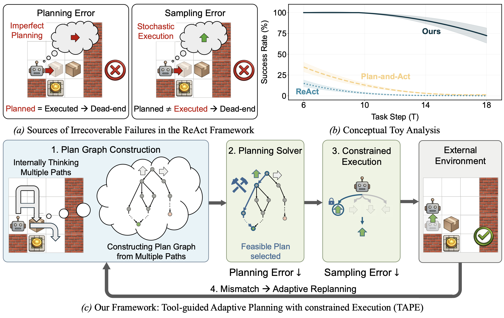

<h1 align="center"> <p>TAPE: Tool-Guided Adaptive Planning and Constrained Execution in Language Model Agents</p></h1>
<h3 align="center">
<p>
Jongwon Jeong<sup>1</sup>,
Jungtaek Kim<sup>1</sup>,
Kangwook Lee<sup>1,2,3</sup>,
</p>
<p>
<sup>1</sup>University of Wisconsin–Madison &nbsp;·&nbsp;
<sup>2</sup>KRAFTON &nbsp;·&nbsp;
<sup>3</sup>Ludo Robotics
</p>
    <a href="https://arxiv.org/abs/2602.19633">
    
</h3>

Language Model (LM) agents have demonstrated remarkable capabilities in solving tasks that require multiple interactions with the environment. 
However, they remain vulnerable in environments where a single error often leads to irrecoverable failure, particularly under strict feasibility constraints.
We systematically analyze existing agent frameworks, identifying imperfect planning and stochastic execution as the primary causes.
To address these challenges, we propose **T**ool-guided **A**daptive **P**lanning with constrained **E**xecution (**TAPE**).
TAPE enhances planning capability by aggregating multiple plans into a graph and employing an external solver to identify a feasible path.
During execution, TAPE employs constrained decoding to reduce sampling noise, while adaptively re-planning whenever environmental feedback deviates from the intended state.
Experiments across Sokoban, ALFWorld, MuSiQue, and GSM8K-Hard demonstrate that TAPE consistently outperforms existing frameworks, with particularly large gains on hard settings, improving success rates by 21.0 percentage points on hard settings on average, and by 20.0 percentage points for weaker base models on average.

<p align="center">
  
</p>
<p align="center"><em>
<b>Figure 1. Overview.</b> We illustrate our work using Sokoban, where the goal is to push all boxes onto target locations.
<b>(a) Sources of Irrecoverable Failure in the ReAct Framework.</b> A planning error occurs when the internal reasoning suggests a non-viable action (e.g., pushing a box against a wall); this makes the goal unachievable because the agent cannot pull the box from the wall. A sampling error arises when LM stochasticity leads to an action that deviates from the plan.
<b>(b) Conceptual Toy Analysis.</b> We model simplified agents by injecting planning and sampling errors into a feasible policy for Sokoban. We measure success rates as the task step <code>T</code> increases, and observe that existing frameworks degrade rapidly as <code>T</code> grows.
<b>(c) Our Framework.</b> <b>TAPE</b> generates and aggregates multiple plans into a graph and uses a solver to select a feasible path, thereby reducing planning errors. It then enforces constrained execution to suppress sampling errors.
</em></p>

### 1) Environment and Dependencies

This repository uses `requirements.txt` for dependency setup.
The file was exported from the current `llm-tool` environment (Python `3.10.18`).

Recommended setup in a fresh conda environment:

```bash
conda create -n tape python=3.10 -y
conda activate tape
pip install --upgrade pip
pip install -r requirements.txt
```

If you want to keep using your existing `llm-tool` environment:

```bash
conda activate llm-tool
pip install -r requirements.txt
```

### 2) Repository Usage

This repository contains Sokoban and ALFWorld experiment code.
The main execution entry points are:

- `src/sokoban_real_experiments.py`
- `src/alfworld_real_experiments.py`
- `src/sokoban_benchmark.py`
- `src/arithmetic_experiment.py`

Argument semantics in Sokoban scripts:

- `--dataset_path`: path to the dataset JSON file.
- `--out_dir`: directory for evaluation outputs (CSV/cache), not the dataset file itself.

Argument semantics in arithmetic script:

- `--dataset_path`: path to GSM-Hard dataset JSON.
- `--agent`: `react`, `pa`, or `ours_graph_ilp`.
- `--time_constraints` / `--cost_constraints`: budget pairs (same length required).

### 3) API Keys

`src/utils/llm.py` initializes clients from these files:

- `keys/openai-key.env`
- `keys/gemini-key.env`
- `keys/anthropic-key.env`

If you only use OpenAI models, `openai-key.env` is typically sufficient.

### 4) ALFWorld Data Path

The default config file is `data/mini_config.yaml`.
It references `$ALFWORLD_DATA`, so set this environment variable first:

```bash
export ALFWORLD_DATA=/path/to/alfworld_data
```

### 5) Quick Start Commands

### Sokoban (1-episode smoke run)

```bash
python src/sokoban_real_experiments.py \
  --agent ours_graph_ilp \
  --model gpt-4.1-mini \
  --episodes 1 \
  --slack 2 \
  --T_targets 6 \
  --num_plans 4 \
  --num_jobs 1 \
  --print_episodes 0
```

### ALFWorld (1-episode smoke run)

```bash
python src/alfworld_real_experiments.py \
  --agent ours_graph_ilp \
  --model gpt-4.1-mini \
  --episodes 1 \
  --slack 8 \
  --config data/mini_config.yaml \
  --split eval_out_of_distribution \
  --num_jobs 1 \
  --print_episodes 0
```

### Arithmetic (GSM-Hard)

```bash
python src/arithmetic_experiment.py \
  --agent react \
  --model gpt-4.1-mini \
  --episodes 1 \
  --num_jobs 1 \
  --print_episodes 0 \
  --time_constraints 0.6 \
  --cost_constraints 0.02
```

### 6) Dataset Generation (Optional)

To rebuild the Sokoban dataset:

```bash
python src/sokoban_benchmark.py \
  --build_dataset \
  --dataset_path data/dataset.json
```

### Citation
```
@article{jeong2026tape,
      title={{TAPE}: Tool-Guided Adaptive Planning and Constrained Execution in Language Model Agents}, 
      author={Jeong, Jongwon and Kim, Jungtaek and Lee, Kangwook},
      year={2026},
      eprint={2602.19633},
      archivePrefix = {arXiv}
}
```
